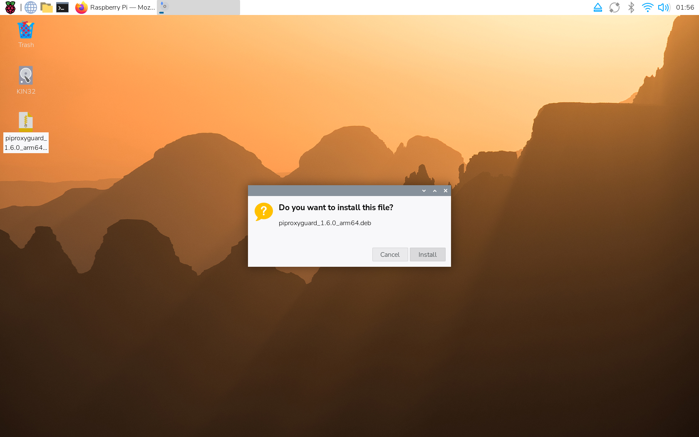
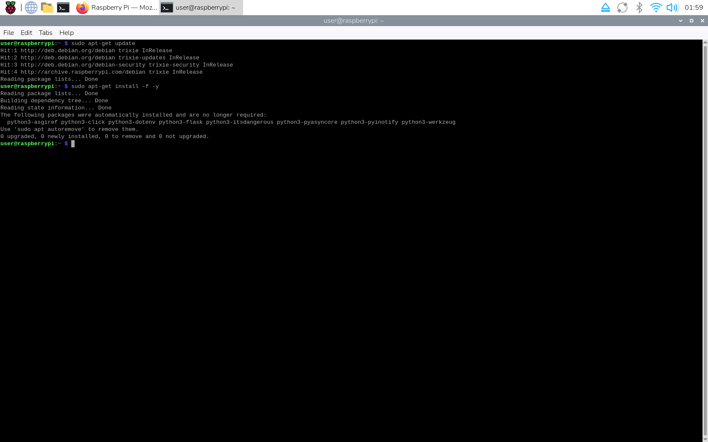
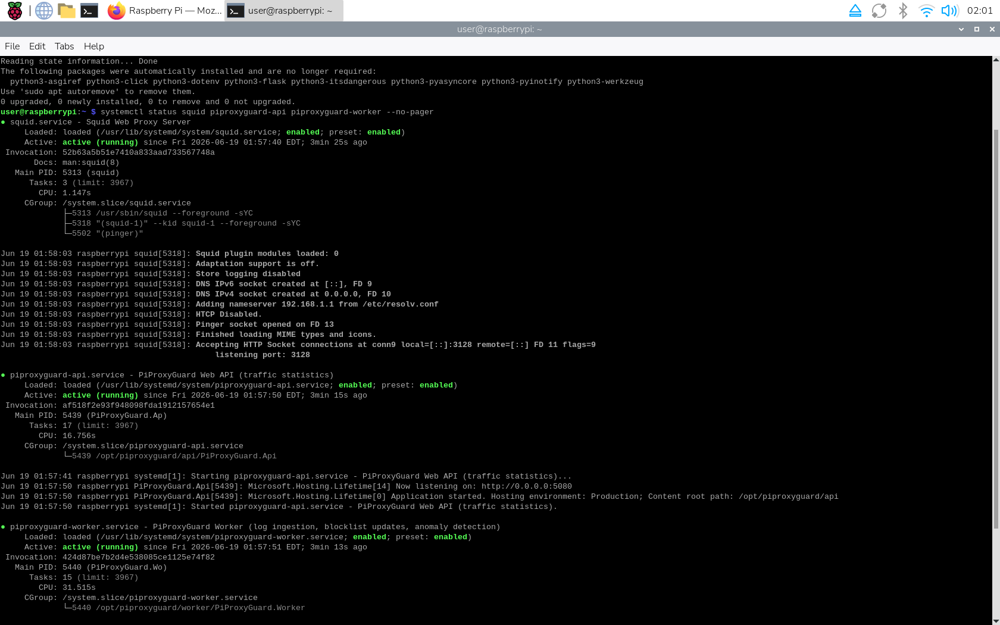
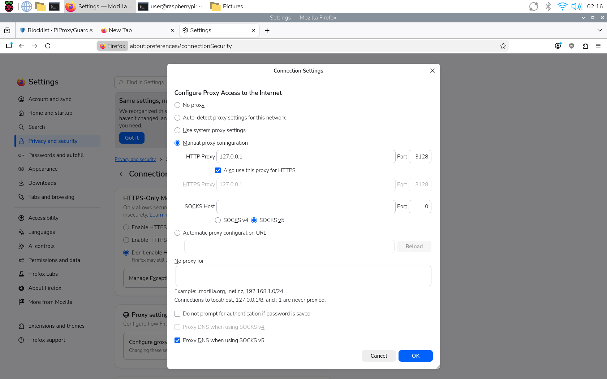

# PiProxyGuard

Home proxy statistics and protection for a Raspberry Pi, built with **.NET 9**.







Squid (or any proxy writing the Squid native log format) does the proxying; PiProxyGuard does everything around it:

- **Worker Service** tails `access.log`, parses every request and stores it in **SQLite** via **EF Core**
- **Web API** serves traffic statistics: totals, top sites, top devices, hourly timeline, status codes
- **Blocklist updater** downloads fresh blocklists (hosts files or HTML pages parsed with **AngleSharp**) on a schedule, merges them with your manual entries and rewrites the Squid ACL file **in place**, then runs `squid -k reconfigure`
- **Suspicious-activity detector** raises alerts for request floods, traffic spikes (vs. each device’s own baseline), repeated denied requests, contacts with blocklisted domains and algorithmically-generated (DGA) hostnames — with optional auto-blocking (TTL) and per-device thresholds
- **Allowlist** that always overrides the blocklist, **notifications** (Telegram / e-mail, configurable from the dashboard), **threat-intel** lookups (free URLhaus), **domain categorization**, **self-diagnostics**, **backup/restore**, **digest reports** and **Prometheus** metrics

## Architecture

```
                       ┌──────────────────────────── Raspberry Pi ───────────────────────────┐
 devices ── :3128 ──►  Squid ──► /var/log/squid/access.log                                    │
                       │             │ tail + parse                                           │
                       │             ▼                                                        │
                       │   PiProxyGuard.Worker ───────► SQLite (piproxyguard.db)              │
                       │   • LogIngestionService            ▲                                 │
                       │   • BlocklistUpdateService         │ EF Core                         │
                       │   • SuspiciousActivityService      │                                 │
                       │             │                 PiProxyGuard.Api ◄── :5080 ── you      │
                       │             ▼                 /api/stats, /api/alerts, /api/blocklist│
                       │   /etc/squid/blocked_domains.acl  (+ squid -k reconfigure)           │
                       └──────────────────────────────────────────────────────────────────────┘
```

| Project | Purpose |
|---|---|
| `PiProxyGuard.Domain` | Entities, enums, parser/feed abstractions, **repository + Unit of Work abstractions**, statistics read models — no dependencies |
| `PiProxyGuard.Infrastructure` | EF Core + SQLite, **repository + Unit of Work implementations**, Squid log parser, file tailer, blocklist feeds (plain/hosts/HTML via AngleSharp), ACL writer, detector |
| `PiProxyGuard.Worker` | `BackgroundService` host: ingestion, blocklist updates, detection |
| `PiProxyGuard.Api` | ASP.NET Core Web API + Swagger, optional API key |
| `PiProxyGuard.Tests` | xUnit tests for parser, tailer, feeds, detector and the stats repository |

Worker and API are separate systemd services sharing one SQLite file (`Cache=Shared`; both apply migrations on startup, so start order does not matter).

### Data access: Repository + Unit of Work

All persistence goes through the **Repository** and **Unit of Work** patterns instead of injecting `AppDbContext` directly:

- `IUnitOfWork` (Domain) owns one `AppDbContext` per scope and exposes aggregate-specific repositories (`ProxyLogs`, `BlockedDomains`, `Alerts`, `IngestionStates`); `SaveChangesAsync` commits all staged changes in one transaction.
- `IRepository<T>` provides the shared write operations; each repository (e.g. `IProxyLogRepository`) adds its own query methods that run as SQL `GROUP BY` and return small read models from `PiProxyGuard.Domain.Statistics` — controllers, the detector and the worker never touch EF Core or `IQueryable`.
- Implementations live in `PiProxyGuard.Infrastructure.Persistence.Repositories`; everything is registered as scoped in `AddPiProxyGuardInfrastructure`.

## API overview

| Endpoint | Description |
|---|---|
| `GET /api/stats/summary?fromUtc=&toUtc=` | Requests, bytes, denied count, unique clients/hosts (default: last 24 h) |
| `GET /api/stats/top-hosts?count=20` | Most requested sites |
| `GET /api/stats/top-clients?count=20` | Most active devices by traffic |
| `GET /api/stats/timeline?interval=hour\|day` | Requests/bytes per bucket |
| `GET /api/stats/status-codes` | HTTP status distribution |
| `GET /api/stats/methods` | HTTP method distribution (GET, POST, CONNECT, ...) |
| `GET /api/stats/content-types?count=20` | Response content-type distribution |
| `GET /api/stats/result-codes` | Squid result-code distribution (TCP_HIT, TCP_MISS, TCP_DENIED, ...) |
| `GET /api/stats/performance?count=20&minRequests=5` | Slowest hosts by average proxy latency |
| `GET /api/stats/ingestion` | Log ingestion bookmarks (file, byte offset, last update) |
| `GET /api/alerts?onlyUnacknowledged=true` | Suspicious-activity alerts |
| `POST /api/alerts/{id}/acknowledge` | Close an alert |
| `GET /api/blocklist?source=Manual&search=ads` | Browse the blocklist |
| `POST /api/blocklist` `{ "domain": "ads.example.com", "reason": "...", "expiresInHours": 24 }` | Block a domain (ACL rewritten immediately); optional TTL |
| `DELETE /api/blocklist/{id}` | Unblock |
| `POST /api/blocklist/refresh` | Re-download all feeds now |
| `GET/POST/DELETE /api/allowlist` | Manage the allowlist — domains that must never be blocked (overrides the blocklist) |
| `GET /api/stats/categories` | Traffic grouped by category (ads, tracking, social, streaming, CDN, malware) |
| `GET /api/threat-intel/check?domain=` | Look a domain up against threat intel (free URLhaus) |
| `GET /api/diagnostics` | Self-diagnostics (db, ingestion, blocklist, ACL); 503 when unhealthy |
| `GET /api/reports/digest?period=day\|week\|month` | Human-readable traffic + security digest |
| `GET /api/backup/export` · `POST /api/backup/import` | Export / restore manual rules + allowlist as JSON |
| `GET/PUT /api/notifications/settings` | Read / update the Telegram + e-mail notification settings (secrets are write-only — never returned) |
| `POST /api/notifications/test` `{ "channel": "Telegram" }` | Send a test message through one channel (`Telegram` or `Email`) |
| `GET /metrics` | Prometheus metrics (no API key required) |
| `GET /health` · `GET /health/ready` | Liveness / readiness probes |

Swagger UI: `http://<pi>:5080/swagger`. The same notification settings can be edited from the dashboard **Settings** page at `http://<pi>:5080/settings`.

Hardening for `/api` (all optional, off by default — the dashboard stays open on a trusted LAN):

- `Api:ApiKey` — require an `X-Api-Key` header on every `/api` request. Recommended if you expose the API outside your LAN (better still: keep it behind WireGuard).
- `Api:RateLimitPerMinute` — when greater than 0, a fixed-window rate limiter caps each client IP to that many `/api` requests per minute; requests over the limit get `429 Too Many Requests`. The dashboard, SignalR hub, `/health`, `/metrics` and `/swagger` are never limited.
- `Api:UseHttpsRedirection` — enable HSTS and redirect HTTP → HTTPS. Requires an HTTPS Kestrel endpoint/certificate to be configured (otherwise it logs a warning and does nothing).

## Configuration highlights (`appsettings.json`)

```jsonc
"AccessLog":  { "Path": "/var/log/squid/access.log", "PollIntervalSeconds": 15, "RetentionDays": 90 },
"Blocklist": {
  "UpdateIntervalHours": 12,
  "AclFilePath": "/etc/squid/blocked_domains.acl",
  "ReloadCommand": "squid -k reconfigure",
  "Feeds": [
    { "Url": "https://raw.githubusercontent.com/StevenBlack/hosts/master/hosts", "Format": "hosts" },
    { "Url": "https://urlhaus.abuse.ch/downloads/hostfile/", "Format": "hosts" },
    // HTML feeds are parsed with AngleSharp using a CSS selector:
    { "Url": "https://example.com/threats.html", "Format": "html", "CssSelector": "table#threats td.domain" }
  ]
},
"Detection": {
  "IntervalMinutes": 5, "WindowMinutes": 5,
  "MaxRequestsPerWindow": 600, "MaxBytesPerWindow": 524288000, "MaxDeniedPerWindow": 20
},
"Api": {
  "ApiKey": "",                 // empty = open on the LAN; set to require X-Api-Key
  "RateLimitPerMinute": 0,      // > 0 enables a fixed-window 429 limiter on /api
  "UseHttpsRedirection": false  // true = HSTS + HTTP->HTTPS (needs an HTTPS endpoint)
}
```

**Notifications.** Telegram and e-mail (SMTP) alerts are configured at runtime from the
dashboard **Settings** page (`/settings`) and stored in the database, so any change takes
effect within seconds — no `appsettings` edit, no restart — on every install (Docker,
`.deb`, tarball). The `Notifications` section of `appsettings`/environment is still honoured
as a fallback when nothing has been saved yet. The same settings are available over REST at
`GET`/`PUT /api/notifications/settings` and `POST /api/notifications/test`; secrets (the bot
token and the SMTP password) are write-only and never returned.

## Running with Docker

A `docker-compose.yml` brings up Squid, the Worker and the API with shared
volumes (database + Squid config/logs):

```bash
docker compose up -d --build
# API + Swagger + /metrics on :5080, proxy on :3128
```

Images build for both `linux/amd64` and `linux/arm64` (Raspberry Pi). To build
a single image directly:

```bash
docker build -f Dockerfile.api    -t piproxyguard-api    .
docker build -f Dockerfile.worker -t piproxyguard-worker .
```

Configuration is via environment variables using the standard double-underscore
convention, e.g. `Detection__AutoBlockSuspiciousHosts=true`,
`Notifications__Telegram__BotToken=...`, `Api__ApiKey=...`.

## Deploying to the Raspberry Pi

### Install via .deb package (recommended — fully automatic)

Download the `piproxyguard_X.Y.Z_arm64.deb` asset from the [Releases](../../releases) page onto the Pi and install it with apt:

```bash
sudo apt install ./piproxyguard_*_arm64.deb
```

apt pulls in Squid automatically, and the package's post-install script writes the Squid config, creates the `piproxyguard` service user, installs the systemd units and starts the API + Worker for you. Nothing else to run. Open `http://<pi>:5080/` and point your devices at `<pi>:3128`. Remove with `sudo apt remove piproxyguard` (purge with `sudo apt purge piproxyguard`).

### Quick install from the tarball (script)

Grab the `PiProxyGuard-vX.Y.Z-linux-arm64.tar.gz` asset from the [Releases](../../releases) page **onto the Pi**, then run the bundled installer:

```bash
tar -xzf PiProxyGuard-*-linux-arm64.tar.gz
sudo bash deploy/install.sh
```

That single command installs Squid, writes a working `squid.conf`, creates the `piproxyguard` service user + data dir, copies the binaries to `/opt/piproxyguard`, wires up the sudoers rule so the Worker can reload Squid, installs the systemd units and starts everything. No .NET runtime is needed (the binaries are self-contained). When it finishes it prints the dashboard URL.

Open `http://<pi>:5080/` and point your devices' HTTP/HTTPS proxy at `<pi>:3128`. Remove everything again with `sudo bash deploy/uninstall.sh`.

### Manual install (or building from source)

1. **Install Squid** on the Pi and merge `deploy/squid.conf.sample` into `/etc/squid/squid.conf` (it adds the `dstdomain` ACL pointing at the generated blocklist).

2. **Publish** on your dev machine (no .NET runtime needed on the Pi — builds are self-contained):

   ```bash
   ./deploy/publish.sh                 # linux-arm64 (Raspberry Pi OS 64-bit)
   RID=linux-arm ./deploy/publish.sh   # 32-bit OS
   rsync -av publish/ pi@raspberrypi:/opt/piproxyguard/
   ```

3. **Prepare the Pi**:

   ```bash
   sudo useradd -r -s /usr/sbin/nologin piproxyguard
   sudo usermod -aG proxy piproxyguard                  # read squid logs
   sudo mkdir -p /var/lib/piproxyguard
   sudo chown piproxyguard /var/lib/piproxyguard        # sqlite db lives here
   sudo touch /etc/squid/blocked_domains.acl
   sudo chown piproxyguard /etc/squid/blocked_domains.acl   # the worker rewrites this file in place — owning the file is enough, no /etc/squid dir write needed
   # allow the worker to reload squid without full sudo:
   echo 'piproxyguard ALL=(root) NOPASSWD: /usr/sbin/squid -k reconfigure' | sudo tee /etc/sudoers.d/piproxyguard
   ```

   Then set `"ReloadCommand": "sudo /usr/sbin/squid -k reconfigure"` in **both** the Worker's **and** the API's `appsettings.json`. The API hosts the dashboard in-process, so manual block/allow changes made there also rewrite the ACL and must be able to reconfigure Squid — if only the Worker is configured, manual blocks fail to reload and get rolled back.

4. **Install the systemd units**:

   ```bash
   sudo cp deploy/piproxyguard-*.service /etc/systemd/system/
   sudo systemctl daemon-reload
   sudo systemctl enable --now piproxyguard-worker piproxyguard-api
   ```

5. Check: `journalctl -u piproxyguard-worker -f` and open `http://<pi>:5080/swagger`.

### Whole-network blocking (transparent / intercept)

By default PiProxyGuard only filters traffic that is **explicitly routed through the proxy**
(`<pi>:3128`). A device that is not configured to use the proxy bypasses it entirely.

To enforce the blocklist for **every device on the LAN** (phones, TVs, etc.) without per-device
proxy settings and **without decrypting HTTPS**, enable transparent mode. The Pi becomes the
network gateway, `iptables` redirects ports 80/443 into Squid, and Squid peeks at the TLS
ClientHello (SNI) to terminate blocked domains, splicing everything else through untouched
(`ssl_bump peek` + `terminate`/`splice`).

The entire Pi-side setup is automated by the package — no manual config edits:

```bash
# at install time...
sudo PIPROXYGUARD_TRANSPARENT=1 apt install ./piproxyguard_*_arm64.deb
# ...or any time afterwards
sudo piproxyguard-transparent enable
```

This enables IP forwarding, generates a self-signed cert for `https_port` (clients never need it),
appends a managed intercept block to `squid.conf` (with a backup), installs and persists the
`iptables` rules, and remembers the choice so it is re-applied on every upgrade. The **one** step
the package can't do is route your LAN through the Pi — set your router's DHCP gateway to the Pi's
IP (or per-device for testing). Disable any time with `sudo piproxyguard-transparent disable`.

See **[`deploy/transparent/README.md`](deploy/transparent/README.md)** for the full guide, the exact
`squid.conf` additions, prerequisites (Squid built `--with-openssl`) and rollback.

> **Note:** with no decryption, a blocked **HTTPS** site gets a *connection reset* rather than a
> friendly 403 page; HTTP blocks still return the normal 403. DoH/DoT and ECH can hide the SNI and
> bypass SNI-based blocking. The dashboard now shows real per-device IPs instead of just `127.0.0.1`.

### Upstream tunnel (route selected domains through a parent proxy)

The blocklist decides what to *drop*; the **upstream tunnel** decides what to *re-route*. It forwards
**only the domains you choose** through an upstream/parent proxy (a VPN-side proxy, a Tor
`privoxy`, a company proxy, another Squid, ...) while every other domain keeps going out directly —
the runtime-editable mirror of the blocklist/allowlist.

Manage the list from the dashboard's **Upstream tunnel** page (or `GET/POST/DELETE /api/tunnel`);
PiProxyGuard writes it to `/etc/squid/tunnel_domains.acl` (suffix match — `example.com` also covers
`cdn.example.com`) and runs `squid -k reconfigure`. Wire the parent proxy into `squid.conf` once:

```bash
cd deploy/upstream-tunnel
sudo ./setup-upstream.sh enable <host> <port>     # e.g. 10.8.0.1 8888
sudo ./setup-upstream.sh status                   # inspect
sudo ./setup-upstream.sh disable                  # all domains go direct again
```

This adds a managed `cache_peer` + `cache_peer_access` + `never_direct` block (with a backup and a
`squid -k parse` safety check). See **[`deploy/upstream-tunnel/README.md`](deploy/upstream-tunnel/README.md)**
for the full guide.

> **Note:** `never_direct` means the tunneled domains have **no direct fallback** — if the parent
> proxy is down they stop working until you fix it or run `disable` (other traffic is unaffected).
> The tunnel routes traffic; point it at a proxy on the secure side (VPN/Tor) if hiding from the ISP
> is the goal.

## Troubleshooting & diagnostics

Handy commands once it's running on the Pi:

```bash
# If a manual `dpkg -i` left unmet dependencies, fix them:
sudo apt-get update
sudo apt-get install -f -y

# Are the services up?
systemctl status squid piproxyguard-api piproxyguard-worker --no-pager

# Recent logs (last 50 lines each):
journalctl -u piproxyguard-api -n 50 --no-pager
journalctl -u piproxyguard-worker -n 50 --no-pager

# Find the Pi's IP address (use it as <pi> below and as the proxy host on your devices):
hostname -I
```

Open the dashboard:

- On the Pi itself: <http://localhost:5080/>
- From another device on the LAN: `http://<pi>:5080/` (use the IP from `hostname -I`)

Point your devices' HTTP/HTTPS proxy at `<pi>:3128`.

## Running locally (development)

```bash
dotnet test                                       # 81 unit tests
cd src/PiProxyGuard.Worker && dotnet run          # uses sample-logs/access.log, local sqlite + acl file
cd src/PiProxyGuard.Api    && dotnet run          # http://localhost:5080/swagger
```

`appsettings.Development.json` in both projects points at local files, so nothing touches `/etc` or `/var` on a dev machine.

## Repository conventions

- `Directory.Build.props` — net9.0, nullable, analyzers (`latest-recommended`), **TreatWarningsAsErrors** for every project
- `Directory.Packages.props` — Central Package Management (all package versions in one place)
- `.editorconfig` / `.gitattributes` / `nuget.config` — consistent style, line endings and a locked nuget.org source
- `.github/workflows/ci.yml` — build + tests on every push/PR
- `.github/workflows/release.yml` — pushing a tag like `v1.0.0` builds, tests, publishes self-contained **linux-arm64** binaries and attaches `PiProxyGuard-v1.0.0-linux-arm64.tar.gz` / `.zip` to a GitHub Release

## Notes & ideas

- The parser is pluggable (`IProxyLogParser`) — add a `ThreeProxyLogParser` if you switch from Squid to 3proxy.
- Every column the parser captures is now surfaced: `Method`, `ContentType`, `ResultCode` and `ElapsedMs` drive the `/methods`, `/content-types`, `/result-codes` and `/performance` endpoints, and the ingestion bookmark is exposed via `/ingestion`.
- `Detection:AutoBlockSuspiciousHosts` is reserved for auto-blocking hosts behind repeated denied requests; wire it up in `SuspiciousActivityDetector` if you want fully automatic blocking.
- SQLite WAL + shared cache handles the two processes fine at home-network scale (tens of requests/second).
- Pair the Pi with WireGuard for remote access; the API then stays LAN-only.

## License

This project is licensed under the MIT License - see the [LICENSE](LICENSE) file for details.

## Author

**Bohdan Harabadzhyu (Bogdan Garabagiu)**
